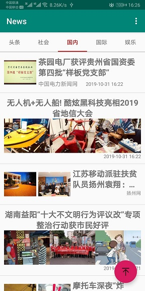
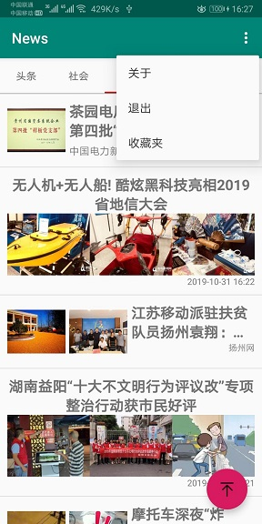
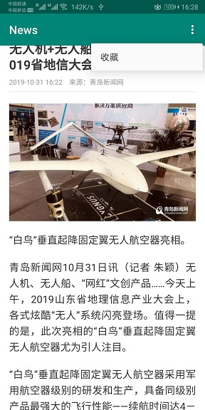
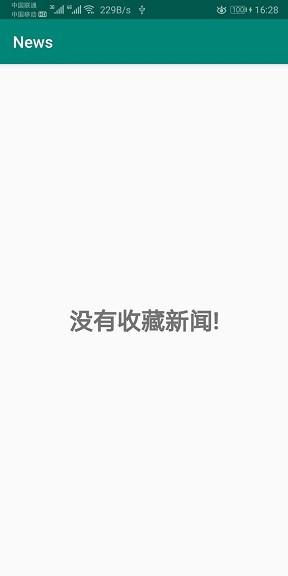
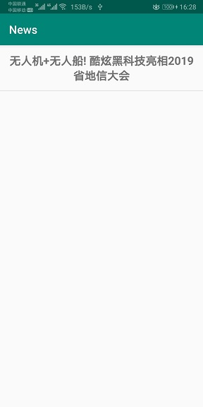
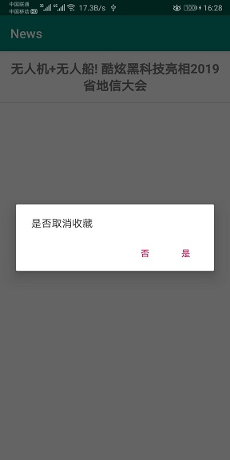

# News
## 新闻App(Android)
* 主界面使用了TabLayout和ViewPager。  
* 通过Activity向Fragment中传递不同的值使Fragment代表多种新闻类型。  
* Fragment中使用RecyclerView实现不同布局(3种)的新闻。  
* 使用Retrofit请求网络，Glide加载图片。  
* 实现RecyclerView的点击事件后通过WebView浏览新闻。  
* 使用greenDAO实现了收藏夹功能。  
## 图片
### 主界面

### 主界面菜单

### 具体新闻页

### 收藏夹(无新闻)

### 收藏夹(有新闻)

### 收藏夹中单项长按点击事件
